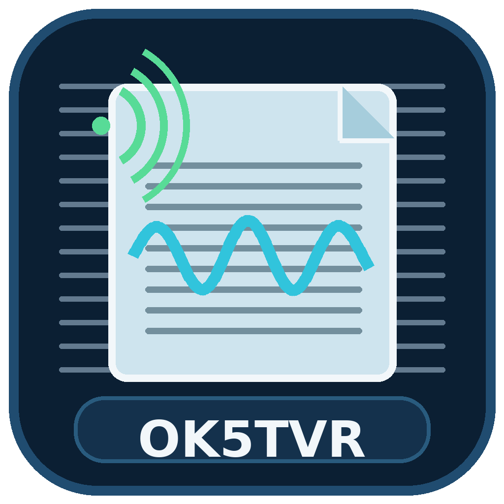

# HFWeatherFax OK5TVR



**HFWeatherFax OK5TVR** is a Windows desktop decoder for analogue HF radiofax / WEFAX weather transmissions. It can decode live audio or recorded audio files, display the spectrum and waterfall, detect START / phasing / STOP sequences, correct the fax image and control a receiver/transceiver directly through Hamlib CAT.

[Česká dokumentace](README.cs.md)

## Download

For normal Windows use, download the latest **`HFWeatherFax_OK5TVR.exe`** from the repository's **Releases** page. The official Release build is a standalone PyInstaller executable; Python is not required on the target PC.

A `SHA256SUMS.txt` file is published with each tagged release so the executable can be verified after download.

> The project does not use `rigctld`. CAT control calls Hamlib directly through `libhamlib-4.dll`. Official Windows builds bundle the required 64-bit Hamlib DLLs.

## Languages

The application contains both:

- **Čeština**
- **English**

Use the **Language / Jazyk** selector in the program controls. The selected language is stored and restored on the next launch. On the first launch, Czech is selected on Czech systems and English elsewhere.

## Main features

- live sound-card reception and WAV/FLAC/OGG decoding,
- 1500 Hz BLACK / 2300 Hz WHITE FM-subcarrier decoding,
- IOC 288 / 576 and LPM 60 / 90 / 120 / 240,
- automatic 300 Hz START and 450 Hz STOP detection,
- recovery from a missed STOP: a new START finalizes the previous fax and begins a new image,
- automatic phasing / LPM and horizontal synchronization,
- automatic BLACK/WHITE calibration,
- automatic and manual slant correction,
- automatic line-start / image wrap correction,
- live FFT spectrum and scrolling waterfall with START / PHASING / IMAGE / STOP markers,
- automatic PNG saving,
- direct Hamlib CAT control without `rigctld`,
- persistent Hamlib path and rig/CAT settings across restarts,
- Hamlib radio model list loaded from the DLL,
- station database, country/service/band filters, favorites and UTC schedules,
- one-click station frequency transfer/tuning through CAT; station-library actions do not change modulation or filter bandwidth.

## Station database

The bundled station catalog is based on NOAA/NWS **Worldwide Marine Radiofacsimile Broadcast Schedules**, dated **7 March 2025**. The original publication warns that worldwide schedules may be incomplete or outdated, so the application retains source/status information for each entry.

For listed assigned frequencies, the program follows the publication convention and calculates a USB carrier frequency as assigned frequency minus 1.9 kHz unless the station entry explicitly states that the listed frequency is already a carrier frequency.

## Run from source

Requirements: 64-bit Python 3.11 or 3.12 on Windows.

```bat
install.bat
run.bat
```

Or manually:

```bat
python -m venv .venv
.venv\Scripts\activate
python -m pip install -r requirements.txt
python main.py
```

Hamlib is optional when running from source. If CAT is required, select an installed/extracted 64-bit Hamlib BIN folder in the program, or place its DLLs in `hamlib\bin`.

## Build the Windows EXE locally

Run:

```bat
build_exe.bat
```

The build script will:

1. create/use `.venv`,
2. install the runtime and build dependencies,
3. download the official Hamlib 4.7.2 x64 ZIP if needed,
4. verify its published SHA-256,
5. build the application with `HFWeatherFax_OK5TVR.spec`.

Result:

```text
dist\HFWeatherFax_OK5TVR.exe
```

The Windows executable contains the OK5TVR application icon and version metadata.

## GitHub Releases

The repository contains `.github/workflows/windows-release.yml`.

A tagged version such as:

```bash
git tag v1.9.2
git push origin v1.9.2
```

starts a Windows build on GitHub Actions. The workflow builds the EXE, generates `SHA256SUMS.txt`, uploads a build artifact and publishes the files to the matching GitHub Release.

A manual build can also be started from the **Actions** tab through `workflow_dispatch`; a manual run produces an Actions artifact but does not create a Release unless the workflow was triggered by a tag.

## Hamlib in official builds

The build process downloads the official **Hamlib 4.7.2 x64** Windows archive from the Hamlib GitHub release and validates the archive against the configured SHA-256 before copying the DLLs into the PyInstaller bundle. See `THIRD_PARTY_NOTICES.md` for third-party information.

## Repository layout

```text
HFWeatherFax_OK5TVR.spec      PyInstaller build definition
main.py                       application entry point
hfweatherfax/                 decoder and GUI source
assets/                       application icon
hamlib/                       local/bundled Hamlib area
scripts/download_hamlib.ps1   verified Hamlib downloader
.github/workflows/            GitHub Actions Release build
requirements.txt              runtime Python dependencies
requirements-build.txt        build dependencies
CHANGELOG.md                  version history
```

## Notes about Windows SmartScreen

The generated EXE is not code-signed unless a code-signing certificate is added to the build process. Windows may therefore display a SmartScreen warning for a newly downloaded Release even when its SHA-256 matches the published checksum. Code signing can be added later without changing the program architecture.

### CAT: manual mode and filter selection

With **Poll 1 s** enabled, the rig's actual mode and filter width are shown in the CAT status line but do **not overwrite** the values selected in **Mode** and **Filter**. Use **Read rig** to intentionally load them from the transceiver and **Set mode** to send your selected values.

